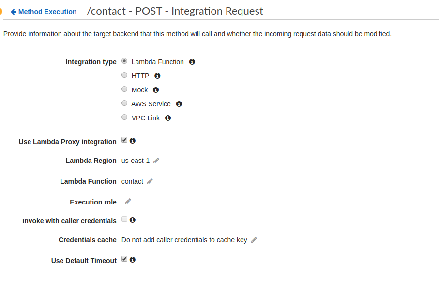

# fake-api-gateway-lambda

This is a testing utility for testing your lambda functions.

You pass it your lambda function and it will start an emulated
AWS API Gateway on a HTTP port and it will redirect all HTTP
requests to your lambda function using Lambda proxy integration.

## Example

```js
const path = require('path')
const FakeApiGatewayLambda =
  require('fake-api-gateway-lambda').FakeApiGatewayLambda
const fetch = require('node-fetch')

async function test() {
  const gateway = new FakeApiGatewayLambda({
    port: 0,
    env: {
      TEST_SETTINGS: '...',
      TEST_S3_BUCKET: 'some-test-bucket-NOT-PROD',
      TEST_DB_NAME: 'my-app-test'
    },
    routes: {
      '/hello': path.join(
        __dirname, 'lambdas', 'hello-world', 'index.js'
      ),
      '/contact': path.join(
        __dirname, 'lambdas', 'contact', 'index.js'
      )
    }
  })

  await gateway.bootstrap()

  const resp = await fetch(`http://${gateway.hostPort}/hello`)

  // Payload of the hello-world lambda response.
  const body = await resp.json()

  await gateway.close()
}

process.on('unhandledRejection', (err) => { throw err })
test()
```

## Design

This testing utility strongly couples AWS lambda & AWS Api gateway.

This library is only useful if you use AWS Api Gateway with
"Use Lambda Proxy Integration" to expose your Lambda over HTTP.



When writing integration tests for your lambdas you want to be able
to author tests like other applications would use your code which
would be through the AWS API gateway API in either the browser
or another application.

Lambda has a very unique execution model, we try to emulate a non
trivial amount of lambda.

The FakeApiGatewayLambda will actually manage a pool of child
processes and will send HTTP req / res to these child processes
so that it can invoke your lambda function, this has similar cold
start semantics to lambda.

The FakeAPIGatewayLambda will only send one HTTP request to a given
child process at a time ( just like real lambda ), so a given child
process lambda worker can only handle one HTTP request at a time.

Currently the library has a concurrency limit of 10 hard coded, other
requests will be queued.

When it comes to invoking & starting your lambda, we pass environment
variables to your lambda by monkey patching `process.env` ;

## Recommended testing approach

Write your lambda to take test parameters from `process.env` ;
For example configuring where it should send emails using SES.

Then use the FakeApiGatewayLambda to start a HTTP server and send
requests to it like you would do from other applications or from
websites over CORS.

## Recommended local development process.

You can also use this testing library for local development.

```js
// bin/dev.js

async function main() {
  const gateway = new FakeApiGatewayLambda({
    port: 8080,
    routes: {
      '/hello': path.join(__dirname, '..', 'lambdas', 'hello.js')
    }
  })

  await gateway.bootstrap();
  console.log('API Gateway running on localhost:8000');
}

process.on('unhandledRejection', (err) => { throw  err })
main();
```

Just add a simple script to your codebase and run it from `npm start`
to start a HTTP server that sends HTTP requests to your lambdas.

You can tell use environment variables to configure this for
local development, aka tell it what resources to use
( local, dev, staging, prod) etc.

## Docs :

### `const server = new FakeApiGatewayLambda(opts)`

Creates a fake api gateway server that routes HTTP traffic
to your lambdas.

 - `opts.port` ; defaults to 0
 - `opts.routes` ; An object where the key is a route prefix and
  the value is the absolute file path to your lambda function.
 - `opts.env` ; An optional env object, the lambdas will have these
  env variables set in `process.env` ; this allows you to pass test
  paramaters to the lambdas.

Your lambda function is spawned as a child process by the ApiGateway
server.

### `await server.bootstrap()`

Starts the server.

After bootstrap returns you can read `server.hostPort` to get the
actual listening port of the server.

### `await server.close()`

Shuts down the server.

## install

```
% npm install fake-api-gateway-lambda
```

## MIT Licensed

